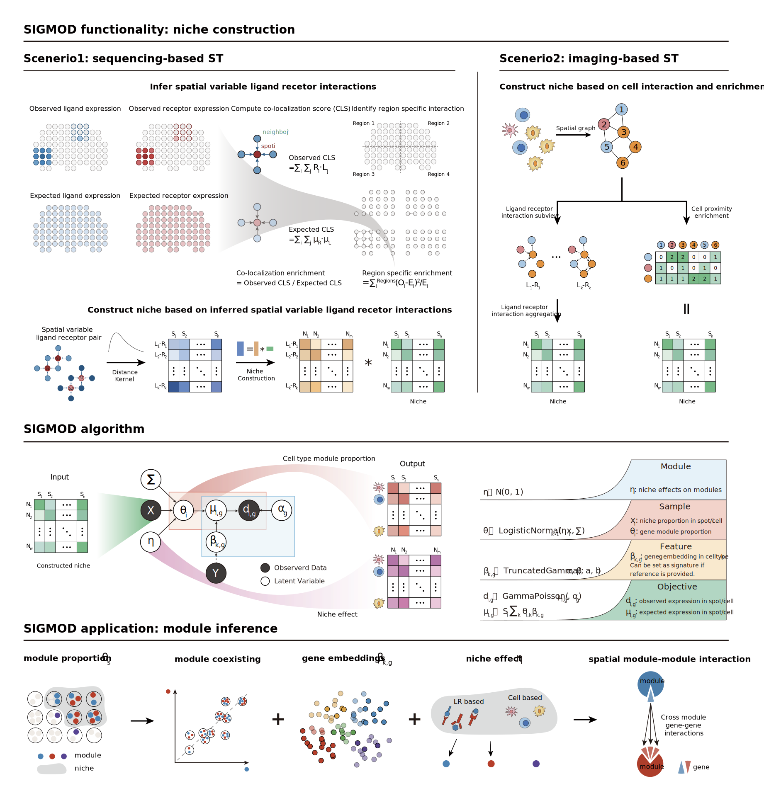

# Deciphering microenvironment heterogeneity by Scalable Niche Guided Module Discovery (SIGMOD)

## Description

SIGMOD comprises two key steps: niche construction and gene module inference. In this study, the niche is defined as the local microenvironment surrounding each cell or spot. SIGMOD offers two primary approaches for niche construction: spatially variable ligand–receptor interaction analysis and proximity-based cell enrichment.

To construct a niche defined by spatially variable ligand–receptor interactions, SIGMOD identifies co-localized ligand–receptor pairs by assuming that relatively high expression of a receptor in a specific spatial region, coupled with relatively high expression of its corresponding ligand in the same region, indicates co-localization of the pair and potential biologically relevant interactions. To achieve this, SIGMOD partitions the space into a grid of unannotated regions (or uses annotated regions if provided), evaluates enriched ligand–receptor pairs across regions, and calculates the probability of interactions to identify those with significant spatial specificity. Each interaction is characterized by both co-localization enrichment and spatial specificity.

To perform niche construction using proximity-based cell enrichment, SIGMOD defines a cell’s niche based on the number and types of neighboring cells within a specified distance. Specifically, for imaging-based data with single-cell resolution (e.g., Xenium), SIGMOD quantifies the interaction strength of specific ligand–receptor pairs within a defined spatial radius and integrates this information into the niche model to guide gene module discovery.



## Installation

```bash
pip install SIGMOD
```

## Tutorial
- [**Spatail variable ligand receptor interaction analysis**](./tutorial/PDAC/SVLR.ipynb)
- [**Niche guided cell module discovery**](./tutorial/PDAC/runPDAC.py)
- [**Downstream analysis(spatial module-module interactions)**](./tutorial/PDAC/ST_analysis.ipynb)
- [**Others for reproducing resutls**](./tutorial/)
